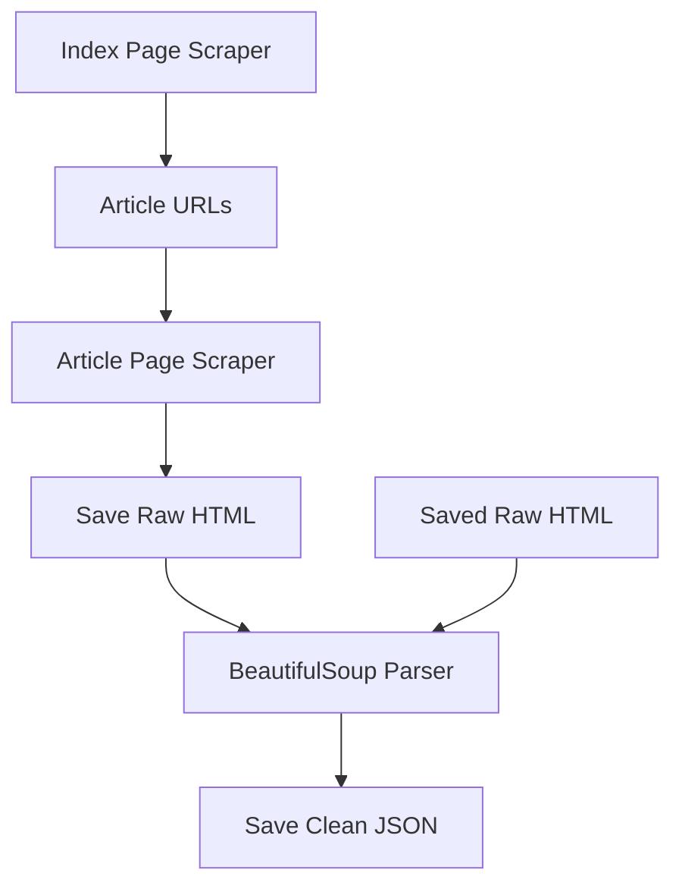

# Module 01: Data Collection

This module covers web scraping techniques to build NLP datasets from scratch.


## Setup

```bash
# Install dependencies
uv sync --all-extras

# Install Playwright browser
uv run playwright install chromium
```


## ANPC Scraper

The ANPC scraper is designed with a decoupled architecture to ensure robustness and data integrity.


### Architecture

1.  **Scraping Layer**: Uses Playwright (recommended) or Selenium to navigate the ANPC website and save the raw rendered HTML of each article.
2.  **Parsing Layer**: A standalone BeautifulSoup parser (`parse_article_html`) that extracts structured data from the saved HTML.



This separation allows for **reprocessing** the entire dataset (e.g., if extraction logic is updated) without putting additional load on the ANPC servers or dealing with network latency.


### Robust Extraction Strategy

The ANPC website uses the Brizy page builder, which results in complex and sometimes inconsistent HTML structures. Our parser uses a multi-tiered approach:
- **Class-based selectors**: Primarily targets stable classes like `brz-wp-post-content` (content) and `brz-wp__postinfo` (metadata).
- **Fallback paths**: Uses precise `nth-of-type` selectors if the preferred classes are missing.
- **Data Cleanup**: Automatic cleaning of titles and normalization of whitespace.


## Usage

```bash
# Run the full scraper
uv run python -m scrapers.anpc_scraper

# Or import and use specific functions
uv run python -c "from scrapers.anpc_scraper import scrape_articles; scrape_articles(max_pages=1)"
```


## Data Output

- `data/raw_html/` - Raw rendered HTML files
- `data/processed/articles_anpc.json` - Structured JSON with extracted fields


## Notebooks

For interactive running from browser or IDE, start the Jupyter server:

```bash
uv run jupyter notebook
```
or
```bash
uv run jupyter-notebook --no-browser
```

Then open the notebook in your browser or IDE/editor.


### Jupyter Notebook

The notebooks are stored in `.py` (percent format) for better version control. To generate or sync the `.ipynb` file, use `jupytext`:

```bash
# Generate the .ipynb file
uv run jupytext --update --to ipynb notebooks/01_scraping_anpc.py
```

Then open the notebook for a walkthrough:

```bash
uv run jupyter notebook notebooks/01_scraping_anpc.ipynb
```


## Tests

It is recommended to run tests from the **project root** to ensure consistent coverage reporting across the entire workspace:

```bash
# From the repository root:
uv run pytest
```

If running from within this directory:

```bash
# Run all tests (unit + e2e)
uv run pytest tests/ -v

# Run only unit tests
uv run pytest tests/test_anpc_scraper.py -v

# Run only E2E tests (makes real requests)
uv run pytest tests/test_anpc_scraper_e2e.py -v
```

### Code Coverage

Coverage configuration is managed in the root `pyproject.toml`. To check coverage (includes global ignore rules):

```bash
# From the repository root:
uv run pytest
```

## TODO

Fix the scraper to properly extract all content. Examples where the scraper fails:
- [here](https://anpc.ro/peste-100-de-mari-magazine-controlate-de-anpc-in-ultima-saptamana-in-toata-tara/)
- [here](https://anpc.ro/anpc-controleaza-gazprom-lukoil-si-magazinele-berezka-in-toata-tara/)
- [here](https://anpc.ro/programul-academia-comisarilor-tineri-initiat-de-anpc-incepe-cu-un-amplu-control-intr-un-mall-bucurestean/)