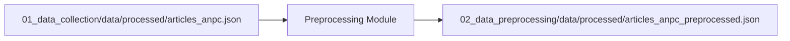

# Module 02: Data Preprocessing

This module focuses on cleaning, normalizing, and structuring the raw data collected in [Module 01](../01_data_collection) for downstream NLP tasks.

## Objectives

1.  **Text Cleaning**:
    *   Remove residual HTML tags/noise (not actually needed for this dataset, but see the TODOs in the previous module).
    *   Handle special characters and whitespace.
    *   Normalize Romanian diacritics (e.g., ensuring consistent use of `ș` and `ț` instead of `ş` and `ţ`).
2.  **Date Normalization**:
    *   Convert Romanian date strings (e.g., "22 decembrie 2025") into ISO-8601 format.
3.  **Tokenization**:
    *   Split text into sentences and words using Romanian-specific models.
4.  **Normalization & Lemmatization**:
    *   Lowercasing.
    *   Stopword removal.
    *   Lemmatization (finding the base form of words) using `stanza` (default) or `spaCy` (alternative).

## Data Cleaning Possibilities

Beyond the basic cleaning implemented in this module, other common NLP preprocessing steps for Romanian include:

*   **URL and Email Removal**: Strip hyperlinks and email addresses using regex.
*   **Social Media Cleanup**: Remove handles (@user), hashtags (#topic), and emojis if they don't add semantic value.
*   **Spelling Correction**: Using libraries like `hunspell` (with Romanian dictionaries) to fix common typos.
*   **Diacritic Restoration**: For datasets where diacritics are missing entirely (common in informal Romanian text).
*   **Profanity Filtering**: Removing or masking offensive language.
*   **Text De-identification**: Masking personal names, locations, or phone numbers (PII).

## Setup

```bash
# Sync dependencies
uv sync --all-extras

# Download nltk data
uv run python -c "import nltk; nltk.download('stopwords'); nltk.download('punkt_tab')"

# Download Romanian Stanza model
uv run python -c "import stanza; stanza.download('ro')"

# Download Romanian SpaCy model
uv run python -c "import spacy; spacy.cli.download('ro_core_news_sm')"
```

## Usage

Input: `articles_anpc.json`

Output: `articles_anpc_preprocessed.json`

```bash
uv run python -m preprocessing.process_dataset
```

Generate the notebook:

```bash
uv run jupytext --update --to ipynb notebooks/02_preprocessing.py
```

## Data Flow



## Implementation Plan

1.  **Metadata Parser**: Extract and standardize dates.
2.  **Cleaner**: High-level text cleaning (noise removal).
3.  **NLP Pipeline**: Tokenization, lemmatization, and stopword removal using `stanza` (highest accuracy for Romanian) or `spaCy` (faster performance).
